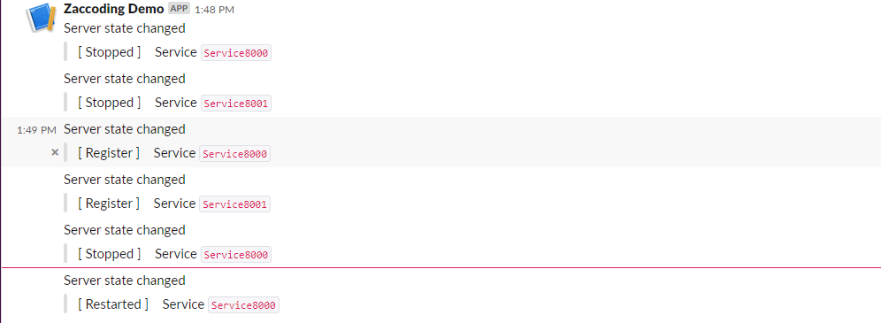
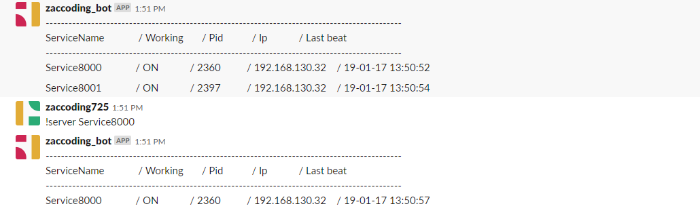

# Heartbeat agent with server  


> ## Heartbeat agent  

by using javaagent send heratbeat request  
(will added process monitor)  

> ## Heartbeat server  

monitoring heartbeat & alert to slack  

---  

> ## Example  

  

  

> ## Getting started  

> ### 1. Maven build

```
$ mvn clean install
```  

> ### 2. Apply agent  

**Agent properties**  

- **javaagent** : java agent instrument
- **Dheartbeat.service_name** : service name must be unique
- **Dheartbeat.server_urls** : server urls where splitted ','
- **Dheartbeat.init_delay** : (optional) heartbeat initial delay (default 5000)
- **Dheartbeat.period** : (optional)  heartbeat period (default 5000)  

**Agent apply**  

- **reference from elastic/apm-agent-java**  
(https://www.elastic.co/guide/en/apm/agent/java/current/application-server-setup.html)

- **Normal use**  

```
$ java -javaagent:/path/to/heartbeat-agent-<version>.jar -Dheartbeat.service_name=Service1 -Dheartbeat.server_urls=http://127.0.0.1:8080/heartbeat -jar demo.jar
```  

- **Tomcat (bin/setenv.sh)**   

```
export CATALINA_OPTS="$CATALINA_OPTS -javaagent:/path/to/heartbeat-agent-<version>.jar"
export CATALINA_OPTS="$CATALINA_OPTS -Dheartbeat.service_name=Service1"
export CATALINA_OPTS="$CATALINA_OPTS -Dheartbeat.server_urls=http://127.0.0.1:8080/heartbeat"
```  

- **Tomcat (bin/setenv.bat)**  

```
set CATALINA_OPTS=%CATALINA_OPTS% -javaagent:/path/to/heartbeat-agent-<version>.jar
set CATALINA_OPTS=%CATALINA_OPTS% -Dheartbeat.service_name=Service1
set CATALINA_OPTS=%CATALINA_OPTS% -Dheartbeat.server_urls=http://127.0.0.1:8080/heartbeat
```  

> ### 3. Running heartbeat server  

- **Running with jar**  

```
$ java -jar target/heartbeat-server-<version>.jar  --spring.config.location=/path/application.yaml
```  

- **Server configs**  

```
## Servers
server:
  port: 8080

## Spring
spring:
  datasource:
    username: sa
    password:
    url: jdbc:h2:file:./db/data;DB_CLOSE_ON_EXIT=FALSE
    driver-class-name: org.h2.Driver
    hikari:
      jdbc-url: jdbc:h2:file:./db/data;DB_CLOSE_ON_EXIT=FALSE
  jpa:
    properties:
      hibernate:
        dialect: org.hibernate.dialect.H2Dialect
    hibernate:
      ddl-auto: update

## Slack apis
slack:
  enabled: true
  web-hook-url: <paste ur webhook url>
  bot-token: <paste ur bot token>
slackApi: https://slack.com/api


## logging
logging:
  level:
    server: debug
```

---  

### Simple design  


### TODO  

- [x] agent impl
- [ ] agent process heartbeat
- [ ] support process heartbeat (1 client <-> n process)
- [ ] agent config file manager
- [x] server impl
- [x] adds slack or others
