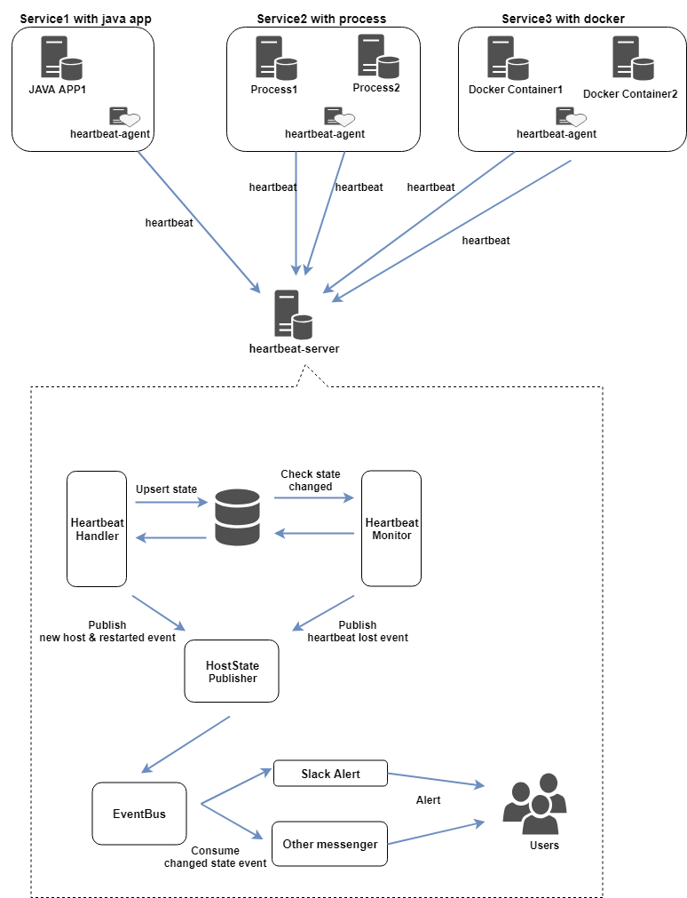

# Heartbeat agent with server  

Check alive about [java process, normal process, docker container]  

> ## Heartbeat agent  

- check process(include docker container) by running java daemon  
- check process by using javaagent & send heratbeat to server
(will added process monitor)  

> ## Heartbeat server  

- monitoring server status > alert some event messages if status is changed  
- support command in slack bot  

<br /><br />

---  

> ## Demo  

  

- alert server status changed event (WebHooks)  
- reply server command (Bot)  

---  

> ## Getting started  

> ### 1. Maven build

```
$ mvn clean install
```  

> ### 2. Apply agent  

- agent config json  

```
{
  "serverUrls": [
    "http://localhost:8080/heartbeat"
  ],
  "heartbeatInitDelay": 500,
  "heartbeatPeriod": 1000,
  "services": [
    {
      // "javaagent" | "process" | "docker"
      "type": "javaagent",
      "serviceName": "DemoAppService",
      "processIdFile": "",
      "processNames": "",
      "dockerNames": "ndb"
    }
  ]
}
```  

> #### 2.1 Start javaagent  

- **Normal use**  

```
$ java -javaagent:/path/to/heartbeat-agent-<version>.jar -Dheartbeat.config.location=/path/config.json -jar yourapp.jar
```  

- **Tomcat (bin/setenv.sh)**   

```
export CATALINA_OPTS="$CATALINA_OPTS -javaagent:/path/to/heartbeat-agent-<version>.jar"
export CATALINA_OPTS="$CATALINA_OPTS -Dheartbeat.config.location=/path/config.json
```  

- **Tomcat (bin/setenv.bat)**  

```
set CATALINA_OPTS=%CATALINA_OPTS% -javaagent:/path/to/heartbeat-agent-<version>.jar
set CATALINA_OPTS=%CATALINA_OPTS% -Dheartbeat.config.location=/path/config.json
```  

> #### 2.2 Start java app  

```
$ java -Dheartbeat.config.location=/path/config.json -jar heartbeat-agent-0.0.1.jar  

or

$ use start.sh in resources/bin  
```  

<br />  

---  

> ### 3. Running heartbeat server  

- **Running with jar**  

```
// Override configs default is below settings
$ java -jar target/heartbeat-server-<version>.jar  --spring.config.location=classpath:/application.yaml,/path/application.yaml
```  

- **Server configs**  

```
## Servers
server:
  port: 8080

## Spring
spring:
  datasource:
    username: sa
    password:
    url: jdbc:h2:file:./db/data;DB_CLOSE_ON_EXIT=FALSE
    driver-class-name: org.h2.Driver
    hikari:
      jdbc-url: jdbc:h2:file:./db/data;DB_CLOSE_ON_EXIT=FALSE
  jpa:
    properties:
      hibernate:
        dialect: org.hibernate.dialect.H2Dialect
    hibernate:
      ddl-auto: update

## Slack apis
slack:
  enabled: true
  web-hook-url: <paste ur webhook url>
  bot-token: <paste ur bot token>
slackApi: https://slack.com/api


## logging
logging:
  level:
    server: debug
```

---  

### Simple design  



### TODO  

- [x] agent impl
- [x] agent process heartbeat  
- [x] support process heartbeat (1 client <-> n process)
- [ ] agent config file manager
- [x] server impl
- [x] adds slack or others
